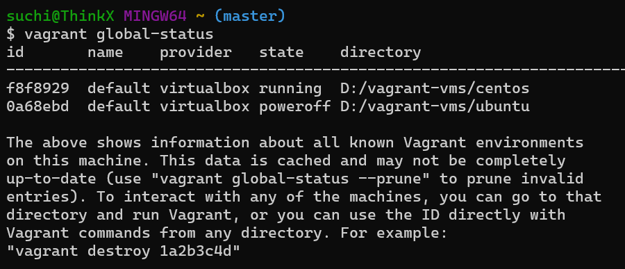
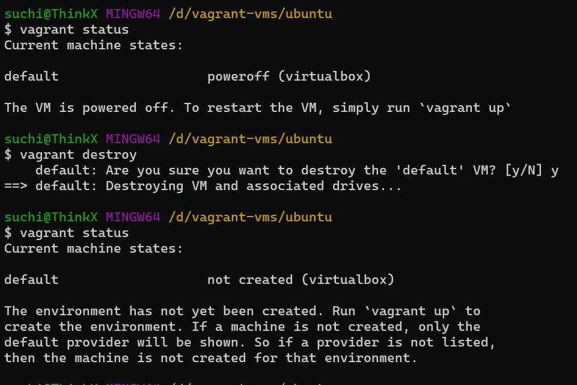
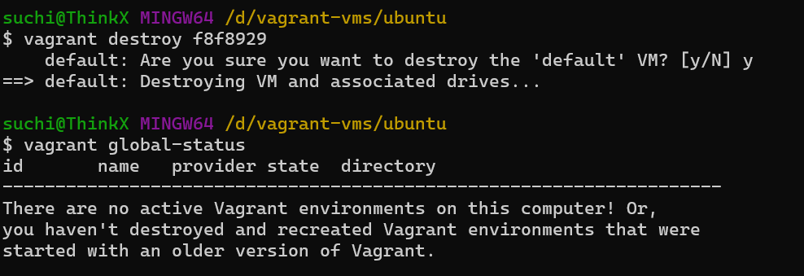

# To delete vagrant managed vms 

we can do it via 2 method 

1. directly navigate to the directory and delete the vm 
2. by using id 

1. method 1:

step 1: first out the location where vagrant file is saved 

-- > vagrant global-status 

navigate to that folders

example -> cd /d/vagrant-vms/ubuntu/

check the status 
 -> vagrant status 

to decomission 
-> vagrant destory 

2. method 2:

step 1: identify the vm details 
-> vagrant global-status

step 2: copy the id 

step 3: to decommission
-> vagrant destory <id>

