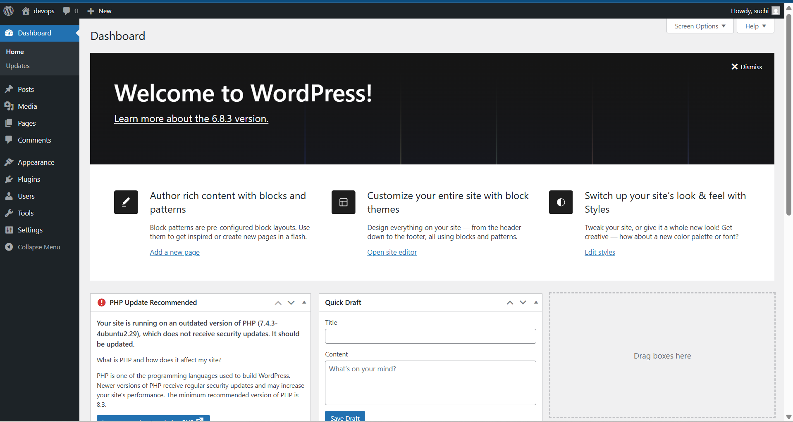

# 🐧 WordPress on Ubuntu via Vagrant + VirtualBox

In this scenario, we’ll build a **WordPress site on Ubuntu Server 20.04** using a **Vagrant box** running in **VirtualBox**.

Reference: [Ubuntu WordPress Tutorial](https://ubuntu.com/tutorials/install-and-configure-wordpress#1-overview)

---

##  Prerequisites

Before we begin, let’s download the **Ubuntu Server 20.04** Vagrant box.

1. Go to [Vagrant Cloud](https://portal.cloud.hashicorp.com/vagrant/discover?query=) and search for `ubuntu/focal64`. 
2. Note the latest box version (e.g., `20240821.0.1`).

---

##  Setup Steps

### Step 1: Create and Navigate to Your Project Folder

```bash
mkdir wordpress_ubuntu
cd wordpress_ubuntu
```

### Step 2: Initialize the Vagrant Box

```bash
vagrant init ubuntu/focal64 --box-version 20240821.0.1
```

### Step 3: Validate the Vagrantfile

```bash
ls
```

You should see a file named `Vagrantfile`.

### Step 4: Check VM Status

```bash
vagrant status
```

> At this point, the VM is not yet created.

---

##  Step 5: Configure the Vagrantfile

Open the `Vagrantfile` in your editor and configure networking as needed. For example, to set up a private network:

```ruby
config.vm.network "private_network", ip: "192.168.56.10"
```

You can also configure synced folders or memory/CPU settings here.

---

### Step 6: Start the Virtual Machine

```bash
vagrant up
```

This will download the box (if not already cached), create the VM, and boot it up.

---

### Step 7: Follow the Ubuntu WordPress Setup Guide

Now that your Ubuntu VM is running, SSH into it:

```bash
vagrant ssh
```

Then follow the steps from the official Ubuntu tutorial to install and configure WordPress:

 [Install and Configure WordPress on Ubuntu](https://ubuntu.com/tutorials/install-and-configure-wordpress#1-overview)

---

## 🖼️ Screenshots (Optional)


